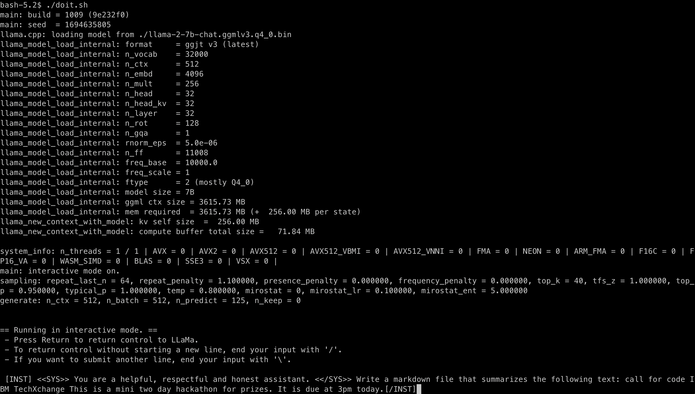
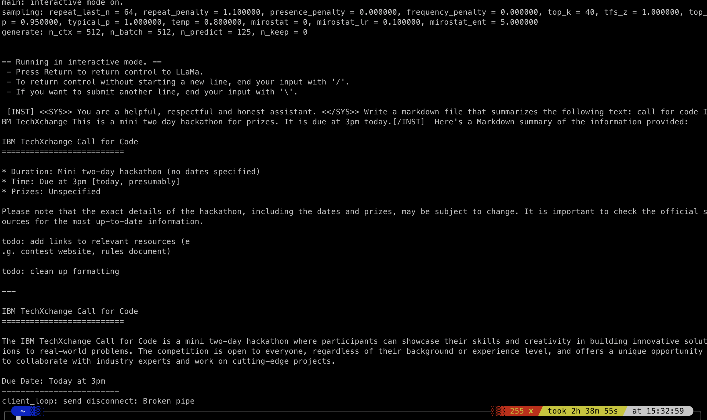

# Notes


# Previous work for another hackathon

* [devpost proj entry](https://devpost.com/software/virtual-sensors-for-water-level-prediction)
* [previous git repo](https://github.com/gdg-cloud-rtp-devpost-tf-2019/tf-hackathon)

## Hi-lites on orig repo

| code                 | Notes                                                                                             |
| -------------------- | ------------------------------------------------------------------------------------------------- |
| src/ML-try-007.ipynb | Was the final submission code                                                                     |
|                      | Sets up the notebook to use tensorboard.                                                          |
|                      | I doubt tensorboard works in watsonx - remove it                                                  |
|                      | Uses ./csv/usgs_gsvb_v2.csv for data                                                              |
|                      | The input has 9K rows and 8 columns                                                               |
|                      | Should break this up into a single file to generate the clean data including a yaml data contract |
|                      | adds new columns, normalizes the data                                                             |
|                      | -- cut off for cleaning data --                                                                   |
|                      |  The rest of the code has:                                                                        |
|                      |     * Defining model                                                                              |
|                      |     * training model                                                                              |
|                      |     * testing model                                                                               |
| csv/usgs_gsvb_v2     | Initial set of *raw* data                                                                         |
|                      | Originally this data came from two sources USGS and Greenstream sensor data                       |
|                      | This dataset has been massaged and combined previously to make the current file.                  |


# other urls

* [the guy who did demo code](https://github.com/nicknochnack)
* [signup to use watson x](https://dataplatform.cloud.ibm.com/wx)
* [hackathong url](https://developer.ibm.com/callforcode/events-register?slug=techxchange)
* [other url](https://compete.cfc-prod.skillsnetwork.site/competitions/call-for-code-at-ibm-techxchange)
* [hackathon resources](https://compete.cfc-prod.skillsnetwork.site/competitions/2023-call-for-code-global-challenge)

# Hackathon Objective

Water is listed as one of the objectives.  The specific water entry is "Address issues of water scarcity and quality".  
In this case, the project measures water level (scarcity) at a postion based upon nearby sensors.


## Installing zopen open source tools

This is a synoposis of this [guide](https://github.com/ZOSOpenTools/meta/releases)

1. download this pax via laptop
    - `https://github.com/ZOSOpenTools/meta/releases/download/v0.6.2/meta-0.6.2.pax.Z`
2. upload to USS on zos system
    - `scp meta-0.6.2.pax.Z netskin@128.168.129.26:/netskin/.`
3. update your shell with proper settings
    - add this to ~/.bashrc
```

export _BPXK_AUTOCVT=ON
export _CEE_RUNOPTS="$_CEE_RUNOPTS FILETAG(AUTOCVT,AUTOTAG) POSIX(ON)"
export _TAG_REDIR_ERR=txt
export _TAG_REDIR_IN=txt
export _TAG_REDIR_OUT=txt
```
    - logout or source your .bashrc and use `$ export ` to see these settings are in effect.
4. Unpack the pax file
    - `cd /netskin`
    - `pax -rf meta-0.6.2.pax.Z`
    - `cd meta-0.6.2`
    - source the `.env` file into your current environment
    - `. ./.env`
5. install the bootstrap
    - `zopen init`
    - specify `/netskin/zopen` as destination
    - NOTE: If it fails due to cacert.pem error, just redo `. ./.env` and `zopen init`
6. Add `zopen-config` to `~/.profile`
    - `. /netskin/zopen/etc/zopen-config`


## Install LLaMa on USS

1. `zopen install llamacpp`
2. download the model
    - `curl -L -O https://huggingface.co/TheBloke/Llama-2-7B-Chat-GGML/resolve/main/llama-2-7b-chat.ggmlv3.q4_0.bin`
3. set patch to the driver
    - `ls /netskin/zopen/usr/local/zopen/llamacpp/llamacpp/bin/`


## USS LLaMa

[Igor's blog post on porting LLaMa to USS](https://igortodorovskiibm.github.io/blog/2023/08/22/llama-cpp/)


Create a script to time execution time to use LLaMa on USS to generate some summary text.


```
$ cat << EOF > doit.sh
start=`date +%s`

main -m ./llama-2-7b-chat.ggmlv3.q4_0.bin -n 125 -i -p "[INST] <<SYS>> You are a helpful, respectful and honest assistant. <</SYS>> Write a markdown file that summarizes the following text: call for code IBM TechXchange This is a mini two day hackathon for prizes. It is due at 3pm today.[/INST]"

end=`date +%s`

runtime=$((end-start))

echo $runtime
EOF
```
### start



### stop


